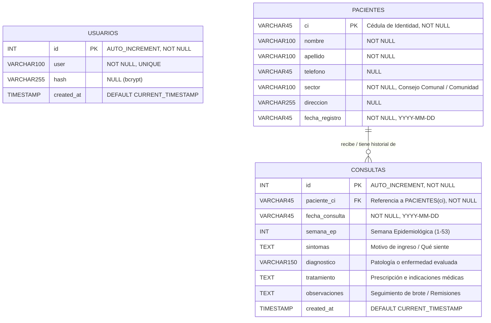

Diagrama Entidad-Relación Mermaid

```mermaid
erDiagram
    USUARIOS {
        INT id PK "AUTO_INCREMENT, NOT NULL"
        VARCHAR100 user "NOT NULL, UNIQUE"
        VARCHAR255 hash "NULL (bcrypt)"
        TIMESTAMP created_at "DEFAULT CURRENT_TIMESTAMP"
    }

    PACIENTES {
        VARCHAR45 ci PK "Cédula de Identidad, NOT NULL"
        VARCHAR100 nombre "NOT NULL"
        VARCHAR100 apellido "NOT NULL"
        VARCHAR45 telefono "NULL"
        VARCHAR100 sector "NOT NULL, Consejo Comunal / Comunidad"
        VARCHAR255 direccion "NULL"
        VARCHAR45 fecha_registro "NOT NULL, YYYY-MM-DD"
    }

    CONSULTAS {
        INT id PK "AUTO_INCREMENT, NOT NULL"
        VARCHAR45 paciente_ci FK "Referencia a PACIENTES(ci), NOT NULL"
        VARCHAR45 fecha_consulta "NOT NULL, YYYY-MM-DD"
        INT semana_ep "Semana Epidemiológica (1-53)"
        TEXT sintomas "Motivo de ingreso / Qué siente"
        VARCHAR150 diagnostico "Patología o enfermedad evaluada"
        TEXT tratamiento "Prescripción e indicaciones médicas"
        TEXT observaciones "Seguimiento de brote / Remisiones"
        TIMESTAMP created_at "DEFAULT CURRENT_TIMESTAMP"
    }

    PACIENTES ||--o{ CONSULTAS : "recibe / tiene historial de"
```

